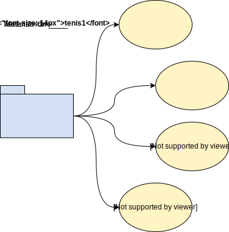
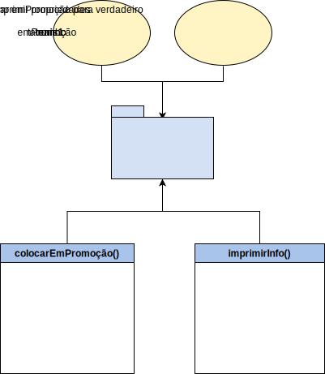
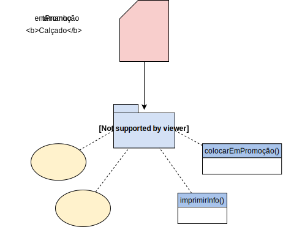
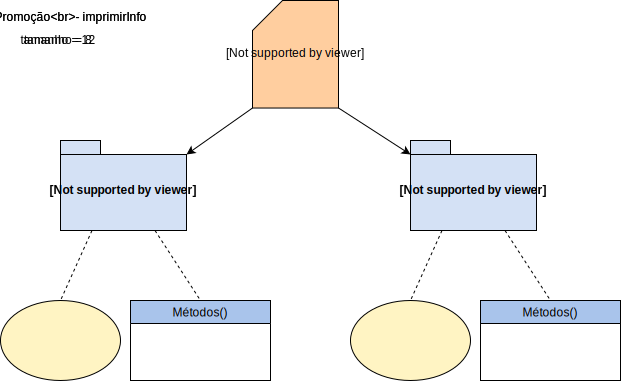

<title>Aula 12 — Slides</title>

# **SISB093 - Programação 3**

## Aula 12

Prof. Thiago Cavalcante

---

<!-- paginate: true -->

# <!-- fit --> Programação Orientada a Objetos

* POO ou OOP (*object oriented programming*)
* **Paradigma** (modelo, padrão, conceitos, princípios)
* Baseado nos conceitos de **classes** e **objetos**
* **Objetos** possuem atributos e comportamentos
* **Classes** funcionam como "moldes" ou "receitas" para criação de objetos
* Em Python, *tudo é um objeto*

---

# Objetos

* Entidades **concretas** que fazem parte do programa
* Interagem entre si para a solução de problemas
* Armazenam **dados** em **variáveis de instância** (propriedades/atributos/estados que os descrevem)
* Objetos diferentes podem ter atributos únicos
* Possuem **métodos** (funções restritas) que definem seu **comportamento** (atualização/exibição de dados)

---

<!-- _footer: Fonte: [Educative](https://www.educative.io/blog/how-to-use-oop-in-python) -->

---

<!-- _footer: Fonte: [Educative](https://www.educative.io/blog/how-to-use-oop-in-python) -->

---

# Classes

* "Receitas" **abstratas** usadas na criação de objetos
* Na classe, estão as definições de atributos e métodos compartilhados entre os objetos criados a partir dela
* Classes são, essencialmente, **tipos definidos pelo programador**
* São facilmente reutilizáveis
* Podem configurar o estado inicial do objeto
* Objetos são **instâncias** de uma **classe**

---

<!-- _footer: Fonte: [Educative](https://www.educative.io/blog/how-to-use-oop-in-python) -->

---

<!-- _footer: Fonte: [Educative](https://www.educative.io/blog/how-to-use-oop-in-python) -->

---

# Benefícios da POO

* Forma simples de modelar coisas complexas
* Reusabilidade entre programas
* Permite comportamento específico de classes distintas para uma mesma interface
* Facilidade para debugar
* Possibilidade de proteção da informação interna de um objeto

---

# Usando POO com Python

* Python é uma linguagem que dá suporte a múltiplos paradigmas de programação
* Listas vs. Objetos

---

# <!-- fit --> Definindo uma classe em Python

Palavra-chave `class`

---

# <!-- fit --> Inicializando objetos e atributos

Método inicializador `__init__` (construtor)
<small>*(um entre vários **dunder methods**)*</small>

---

# <!-- fit --> Adicionando atributos a uma classe

Variáveis de **classe**

---

# <!-- fit --> Adicionando métodos à classe

Classificação: *accessors/getters* e *mutators/setters*

---

# Exercícios

1. Implemente uma classe `LataRefrigerante` com os métodos `areaSuperficie()` e `volume()`. No construtor, forneça a altura e o raio da lata.

---

<!-- _class: small-ol -->

# Exercícios

2. Implemente uma classe `Endereco`. Um endereço tem um número, rua, número de apartamento opcional, uma cidade, um estado e um CEP. Defina o construtor de forma que um endereço possa ser criado com ou sem um número de apartamento. Defina um método `imprimir` que imprime o endereço com a rua em uma linha e a cidade, estado e CEP em outra linha. Forneça um método `mesmoSetor(self, outro)` que testa se o endereço atual se encontra na mesma região, sub-região e setor (três primeiros números do CEP) de outro endereço.

---

# Princípios da POO

* Herança
* Encapsulamento
* Abstração
* Polimorfismo
* Extra: *Modularidade, Composição*
